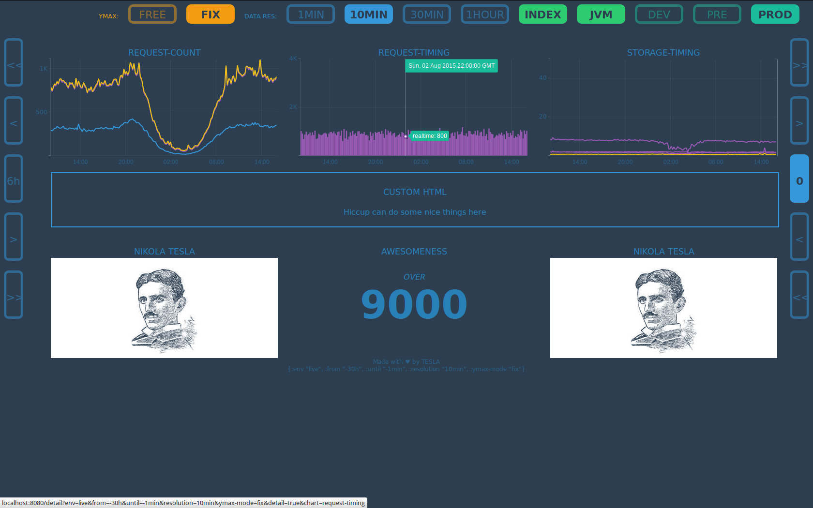
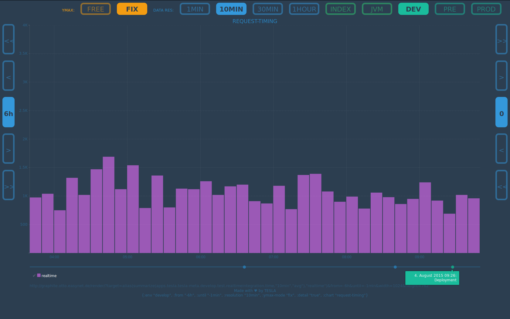

# oscillator

> "The scientific man does not aim at an immediate result. He does not expect that 
   his advanced ideas will be readily taken up. His work is like that of the planter - 
   for the future. His duty is to lay the foundation for those who are to come, and point 
   the way."
   - Nikola Tesla

A Clojure library that lets you create **nice dashboards** with **interactive charts**
to monitor your applications in multiple environments.

This library was developed with Graphite as a data provider in mind.



[](https://travis-ci.org/otto-de/oscillator)
## Usage

[](http://clojars.org/de.otto/oscillator)

You have to set up a small Ring/Compojure application, that will hold your *oscillator*.

### Building Routes

Building the required routes is easy:

```Clojure
;; building compojure routes for your dashboard
(oscillator-routes :page-config               your-page-config
                   :chart-def-fetch-fun       get-chart-definitions
                   :annotation-event-targets  []) 
```

Dashboards, navigation, charts, detail views ... everything will be rendered for you.
You just have to provide some information about the page and what charts should be rendered.

### Page Config

```Clojure
{:base-url       "http://graphite.example.com/"        ;; your graphite server
 :pages          [...]                                 ;; see -> Pages
 :environments   [{:key "dev" :name "DEV"}
                  {:key "pre-prod" :name "PRE"}
                  {:key "production" :name "PROD"}]
 :default-params {:env        "production"
                  :from       "-24h"
                  :until      "-1min"
                  :resolution "10min"
                  :ymax-mode  "fix"
                  :stay       "false"}
 :replace-rules  {}                                    ;; see -> Replace Rules
 :context-path "/path"                                 ;; an optional context-path
 :add-js-files   ["/javascript/your-additional.js"]    ;; additional javascript files
 :add-css-files  ["/stylesheets/your-additional.css"]} ;; additional stylesheet files
```

#### Pages & Tiles

Pages are collections of `tiles`, that can be accessed under a given `url`. Each configured
page will get a button in the navigation bar. Currently there are 4 different types of tiles 
supported: `chart`, `image`, `number`, `plain-html`, `html-fn` 

Pages are defined in a list of hash-maps like this:
```edn
[
 {:name    "INDEX"
  :heading "Overview"
  :url     "/"
  :type    :dashboard
  :tiles   [{:type   :chart
             :params {:chart-name :request-count}}
            {:type   :chart
             :params {:chart-name :request-timing}}
            {:type   :chart
             :params {:chart-name :exceptions-count}}
            {:type   :image
             :params {:src     "nikola-tesla.png"
                      :heading "NIKOLA TESLA"}}
            {:type   :html-fn
             :params (fn [page-config url-params] [:div [:h2 "CUSTOM HTML"]])}
            {:type   :pie-chart
                      :params {:title   "MY-PIE"
                              :data-fn (fn [page-config url-params] [{:text "first" :value 34}
                                                                    {:text "second" :value 14}])}}
            {:type   :number
             :params {:heading "Awesomeness"
                      :descr   "OVER"
                      :num     9000}}
            {:type   :plain-html
             :params [:div {:class "col"}
                      [:h2 "CUSTOM HTML"]
                      [:span "simply use hiccup"]]}]}
 {:name  "JVM"
  :heading "JVM Stats"
  :url     "/"
  :type    :dashboard
  :tiles   [...]}}
]
```

#### Replace Rules

*Replace Rules* are a hash-map of *lookup-patterns* as keys and simple *transformation functions* 
as values.

```edn
{:env          (fn [env] env)
 :logging-env  (fn [env] ((keyword env) {:production "live"} "dev"))}
```

Every rendered graphite `target` will be transformed by those replace rules. If a *lookup-pattern*
is found, it will be replaced by the result of the *transformation function*, 
while the `:key` of the current *environment* is passed as the argument.

These targets:

```
...&target=app-server.#{env}.request.count&target=logging-server.#{logging-env}.error.count
```

and the rules from above and `pre-prod` as the current `env` would result 
in a graphite request these target:

```
...&target=app-server.pre-prod.request.count&target=logging-server.dev.error.count
```

### Chart Definition

You have to provide a lookup-function that can return a hash-map of all
charts. The keys in this map are used to specify a chart in **Pages & Tiles**
configuration.

Each chart can hold multiple targets (data series in the graph). Each data series
has a `key` (used as name) and a `target` (a graphite query). Additional attributes
can be defined: `color`, `renderer`

```clojure
(defn chart-definitions [env]
  {:request-count  {:targets {:request-count   {:target   (req-count-target)
                                                :color    "#0000ff"}
                              :bounces         {:target   (bounces-target)
                                                :color    "#ff00ff"}}}
   :request-timing {:targets {:request-count   {:target   (req-count-target)
                                                :color    "#0000ff"}
                              :request-timing  {:target   (req-timing-target)
                                                :renderer "bar"}}}
  }
)
```


#### Graphite Targets

Graphite targets can be defined with a simple and easy to read DSL, 
so you don't have to write those hard to maintain string-monsters.

Some examples:
```Clojure
(defn req-count-target []
  (dsl/sum-series 
    (dsl/non-negative-derivative "app-serv-#{env}.request.count")))
    
(defn bounces-target []
  (dsl/keep-last-value 
    (dsl/max-series "app-serv-#{env}.*.metrics.stats.offset")))
    
(defn reuse-example []    
  (dsl/diff-series
    (req-count-target)
    (bounces-target)))
```

### Annotations

There are events, that can significantly influence your systems (e.g. deployments, reboots, etc.). To
be able to see which anomaly in your chart correlates with which event, you can provide a list of
*Graphite-Targets* that will be used for event annotation for your charts.



You can provide this list of `annotation-event-targets` while setting up your routes:

```Clojure
(oscillator-routes :page-config               your-page-config
                   :chart-def-fetch-fun       get-chart-definitions
                   :annotation-event-targets  [(dsl/aliaz "deployments.#{env}.count" "Deployment")
                                               (dsl/aliaz "chaos-monkey.#{env}.count" "Chaos Monkey")]) 
```

Annotation will be shown below all charts on detail pages.


## Plans for the future

* an add-on system, that can provide more tile types


## Examples

We hope to have an example application available soon. It will be found like many others at
[tesla-examples](https://github.com/otto-de/tesla-examples).


## FAQ

**Q:** Is it any good? **A:** Yes.


## Initial Contributors

Torsten Mangner, Christian Stamm, Kai Brandes, Florian Weyandt, Daley Chetwynd, Carl Düvel


## License
Apache License
